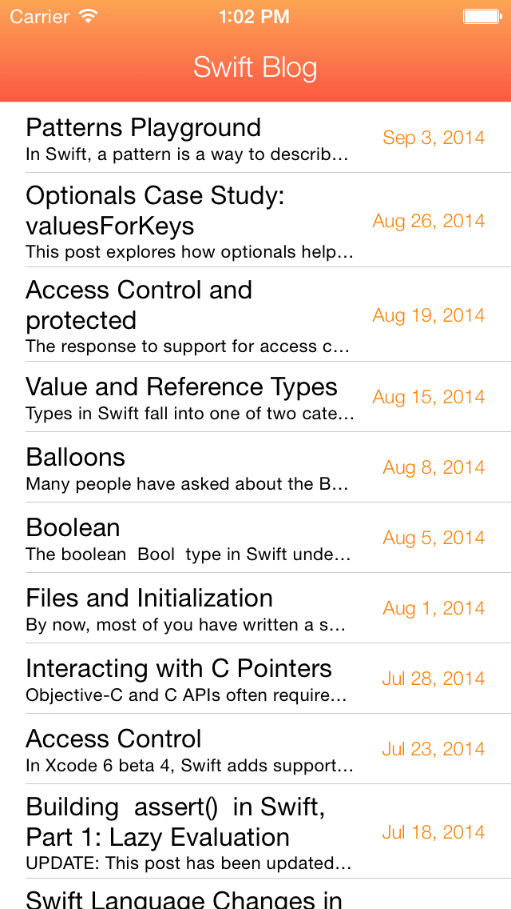

SwiftBlog
=========

A simple Swift app that reads the official Apple Swift Blog via RSS.
I made this app in a few hours just to get used to the Swift language always more. 
It uses the official RSS feed by Apple to read the latest blog posts by the Swift team. 
This project uses UITableView, NSXMLParser and UIWebView.

I hope this example code will be useful to you :)

